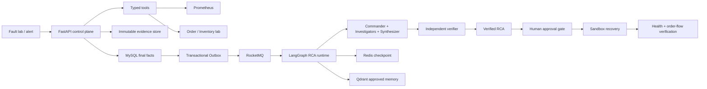

<p align="center">
  
</p>

<h1 align="center">AxiomOps</h1>

<p align="center">
  Evidence-driven multi-agent AIOps incident diagnosis and safe recovery.
</p>

<p align="center">
  <a href="docs/architecture.md">Architecture</a> ·
  <a href="docs/deployment.md">Deployment</a> ·
  <a href="docs/api.md">API</a> ·
  <a href="docs/benchmarks.md">Benchmarks</a>
</p>

<p align="center">
  
  
  
  
  
</p>

## What Is AxiomOps

AxiomOps is a reproducible AIOps lab and control plane for microservice incidents. It turns an alert into typed evidence, runs a bounded multi-agent RCA workflow, verifies every cited claim, and executes recovery only after deterministic approval gates.

The project is intentionally built around a hard rule: agents may reason and recommend, but recovery is owned by auditable backend workflows.

## Why It Exists

LLM-based operations tools often fail in three places:

- They diagnose from loose chat context instead of durable evidence.
- They mix reasoning with execution, making recovery difficult to audit.
- They report impressive results without a repeatable fault set or baseline.

AxiomOps addresses those gaps with ground-truth fault injection, immutable evidence, LangGraph orchestration, role-separated approval, and saved benchmark reports.

## Core Capabilities

| Area | Capability |
| --- | --- |
| Fault lab | Reproducible Order -> Inventory scenarios for latency, error rate, and dependency outage |
| Incident control | MySQL-backed Incident state, audit events, and transactional Outbox dispatch |
| Typed tools | Prometheus metrics, service health, injected fault state, and order-flow probe |
| Evidence | Raw JSON persisted with metadata and SHA-256 integrity checks |
| Agent runtime | Commander, investigator agents, RCA synthesizer, and independent verifier |
| Memory | Redis checkpoint/resume and Qdrant index for approved historical RCA |
| Safe recovery | Commander/Approver/Operator role split with sandbox execution and verification |
| Observability | Prometheus metrics, trace headers, SSE console updates, and evaluation reports |

## Tech Stack

| Layer | Tools |
| --- | --- |
| Agent runtime | Python, FastAPI, LangGraph, DeepSeek-compatible chat endpoint |
| Control plane | MySQL, Redis, RocketMQ, Qdrant |
| Observability | Prometheus, W3C trace headers, structured audit records |
| Lab | Docker Compose, FastAPI microservices, scripted fault injection |
| Console | React, TypeScript, SSE, Lucide Icons |
| Validation | pytest, scenario runners, benchmark scripts |

## Architecture



## End-to-End Flow

1. Inject a known fault into the local Inventory service.
2. Create an Incident in the control plane.
3. Collect typed evidence from metrics, health checks, fault state, and order flow.
4. Run the LangGraph multi-agent RCA workflow.
5. Reject unsupported claims through the independent verifier.
6. Request and approve a bounded recovery action.
7. Execute sandbox recovery and verify both service health and business flow.
8. Persist metrics, traces, audit events, and benchmark artifacts.

## Benchmark Snapshot

The current benchmark suite uses 3 ground-truth scenarios with 3 repeated runs each.

| Metric | Result |
| --- | --- |
| Closed-loop deterministic scenarios | 3 / 3 passed |
| Prometheus evidence coverage | 100% |
| Recovery verification rate | 100% |
| Multi-agent root-cause match | 9 / 9 |
| Single-agent root-cause match | 9 / 9 |
| Multi-agent strict evidence citation coverage | 8 / 9 |
| Single-agent strict evidence citation coverage | 0 / 9 |
| Multi-agent mean latency | 20.28s |
| Single-agent mean latency | 3.06s |

The useful tradeoff is not inflated accuracy on the small deterministic dataset. The multi-agent path improves evidence discipline and independent verification at higher runtime cost, so it is best suited for higher-risk incidents.

More detail: [docs/benchmarks.md](docs/benchmarks.md).

## Quick Start

Prerequisites:

- Python 3.11+
- Docker Desktop
- Node.js 20+

Install Python dependencies:

```powershell
python -m venv .venv
.\.venv\Scripts\python.exe -m pip install -e ".[dev]"
```

Start the local lab and control plane:

```powershell
.\scripts\start_lab.ps1
.\scripts\start_control_plane.ps1
```

Run backend tests:

```powershell
.\.venv\Scripts\python.exe -m pytest
```

Start the console:

```powershell
cd frontend
npm install
npm run dev
```

Open the console printed by Vite, then create an incident and follow the guided workflow.

## Repository Layout

```text
src/axiom_ops/              Python package
src/axiom_ops/control_plane Incident, evidence, RCA, recovery, and observability
src/axiom_ops/lab           Fault-injection microservice lab
frontend/                   React operations console
ops-control-plane/          Docker Compose and MySQL migrations
ops-lab/                    Docker Compose lab services and Prometheus config
scripts/                    Local run and verification scripts
tests/                      Unit and contract tests
docs/                       Public documentation
```

## Documentation

- [Documentation index](docs/README.md)
- [Architecture](docs/architecture.md)
- [Deployment](docs/deployment.md)
- [API](docs/api.md)
- [Benchmarks](docs/benchmarks.md)

## Security Notes

- Do not commit local credentials or runtime artifacts.
- Agents are read-only for diagnosis; recovery is handled by backend policy and role gates.
- Evidence and RCA records are persisted with immutable metadata and integrity checks.
- The default recovery action is scoped to the local sandbox lab.

## License

MIT. See [LICENSE](LICENSE).
