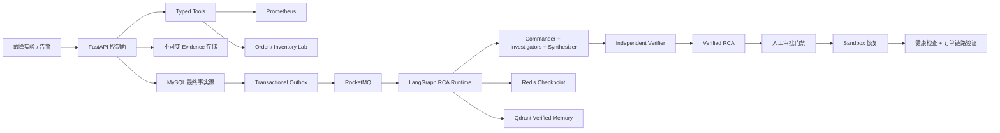

<p align="center">
  
</p>

<h1 align="center">AxiomOps</h1>

<p align="center">
  证据驱动的多 Agent 智能故障诊断与安全恢复系统。
</p>

<p align="center">
  <a href="docs/architecture.md">架构设计</a> ·
  <a href="docs/deployment.md">部署指南</a> ·
  <a href="docs/api.md">API 文档</a> ·
  <a href="docs/benchmarks.md">Benchmark</a>
</p>

<p align="center">
  
  
  
  
  
</p>

## 项目定位

AxiomOps 是一个面向微服务故障场景的可复现实验环境与 Incident 控制面。它将告警转化为类型化 Evidence，通过受控的多 Agent RCA 工作流完成诊断，并在独立验证、人工审批和后端策略门禁之后执行安全恢复。

项目的核心边界很明确：Agent 负责读取证据、推理和生成结构化结论；恢复动作由可审计、可幂等、可回滚的后端流程执行。

## 背景与痛点

把大模型直接接入运维系统时，常见问题不是“能不能回答”，而是回答是否可证明、动作是否可审计、结果是否可复现：

- 诊断依赖松散上下文，缺少可追溯 Evidence。
- 推理和执行混在一起，恢复动作难以审计和回滚。
- 缺少固定故障集与基线对照，效果指标不可复现。

AxiomOps 通过 Ground Truth 故障注入、不可变 Evidence、LangGraph 多 Agent 编排、角色隔离审批和保存的 Benchmark 报告，把一次故障处置拆成可验证的工程闭环。

## 核心能力

| 模块 | 能力 |
| --- | --- |
| 故障实验环境 | 提供 Order -> Inventory 微服务链路，支持延迟、错误率、依赖不可用三类故障注入 |
| Incident 控制面 | 基于 MySQL 管理 Incident 状态、审计事件和 Transactional Outbox |
| Typed Tools | 采集 Prometheus 指标、服务健康、故障注入状态和订单链路探测 |
| 不可变 Evidence | 原始 JSON 落盘，MySQL 保存元数据和 SHA-256 完整性校验 |
| 多 Agent RCA | Commander、Investigator、RCA Synthesizer、Independent Verifier 分工协作 |
| 上下文与记忆 | Redis Checkpoint 支持恢复，Qdrant 索引已验证历史 RCA |
| 安全恢复 | Commander / Approver / Operator 角色隔离，审批后执行 Sandbox 恢复并验证 |
| 可观测与评测 | Prometheus 指标、Trace Header、SSE 时间线和可复现实验报告 |

## 技术栈

| 层级 | 技术 |
| --- | --- |
| Agent Runtime | Python、FastAPI、LangGraph、DeepSeek 兼容 Chat Endpoint |
| 控制面基础设施 | MySQL、Redis、RocketMQ、Qdrant |
| 可观测性 | Prometheus、W3C Trace Header、结构化审计记录 |
| 故障实验 | Docker Compose、FastAPI 微服务、脚本化故障注入 |
| 前端控制台 | React、TypeScript、SSE、Lucide Icons |
| 验证体系 | pytest、场景 Runner、Benchmark 脚本 |

## 架构图



## 全流程链路

1. 在本地 Inventory 服务注入已知故障。
2. 在控制面创建 Incident。
3. 通过 Typed Tools 采集指标、健康状态、故障状态和订单链路 Evidence。
4. 启动 LangGraph 多 Agent RCA 工作流。
5. 由 Independent Verifier 拒绝缺少 Evidence 支撑的结论。
6. Commander 发起恢复请求，Approver 完成人工审批。
7. Operator 执行受限 Sandbox 恢复动作。
8. 同时验证服务健康与业务链路，并保存审计事件、指标和实验报告。

## Benchmark 摘要

当前评测使用 3 个 Ground Truth 故障场景，每个场景重复 3 次。

| 指标 | 结果 |
| --- | --- |
| 确定性故障闭环 | 3 / 3 通过 |
| Prometheus Evidence 覆盖率 | 100% |
| 恢复验证通过率 | 100% |
| 多 Agent 根因命中 | 9 / 9 |
| 单 Agent 根因命中 | 9 / 9 |
| 多 Agent 严格 Evidence 引用覆盖 | 8 / 9 |
| 单 Agent 严格 Evidence 引用覆盖 | 0 / 9 |
| 多 Agent 平均延迟 | 20.28s |
| 单 Agent 平均延迟 | 3.06s |

这个结果没有夸大为“准确率提升”。在当前小规模确定性故障集上，单 Agent 和多 Agent 都能命中根因；多 Agent 的价值主要体现在 Evidence 约束、职责隔离和独立验证，代价是更高的延迟与模型调用成本。因此完整多 Agent 链路更适合高风险、强审计要求的 Incident。

详细说明见 [docs/benchmarks.md](docs/benchmarks.md)。

## 快速启动

前置环境：

- Python 3.11+
- Docker Desktop
- Node.js 20+

安装 Python 依赖：

```powershell
python -m venv .venv
.\.venv\Scripts\python.exe -m pip install -e ".[dev]"
```

启动本地故障实验环境和控制面：

```powershell
.\scripts\start_lab.ps1
.\scripts\start_control_plane.ps1
```

运行后端测试：

```powershell
.\.venv\Scripts\python.exe -m pytest
```

启动前端控制台：

```powershell
cd frontend
npm install
npm run dev
```

打开 Vite 输出的本地地址，创建 Incident，并按页面指引完成证据采集、RCA、审批和恢复验证。

## 仓库结构

```text
src/axiom_ops/              Python package
src/axiom_ops/control_plane Incident、Evidence、RCA、Recovery、Observability
src/axiom_ops/lab           故障注入微服务实验环境
frontend/                   React 运维控制台
ops-control-plane/          Docker Compose 与 MySQL 迁移脚本
ops-lab/                    实验服务、Prometheus 配置与故障场景
scripts/                    本地启动、验证和评测脚本
tests/                      单元测试与契约测试
docs/                       公开项目文档
```

## 文档索引

- [文档总览](docs/README.md)
- [架构设计](docs/architecture.md)
- [部署指南](docs/deployment.md)
- [API 文档](docs/api.md)
- [Benchmark](docs/benchmarks.md)

## 安全说明

- 不要提交本地凭据、运行产物或实验日志。
- Agent 只负责诊断推理，恢复动作由后端策略和角色门禁执行。
- Evidence 与 RCA 持久化保存，并带完整性校验。
- 默认恢复动作只作用于本地 Sandbox 实验环境。

## License

MIT. See [LICENSE](LICENSE).
