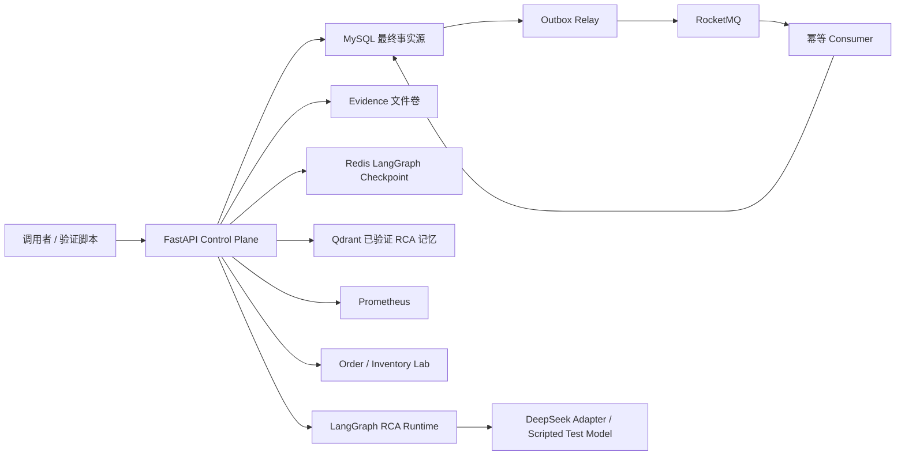
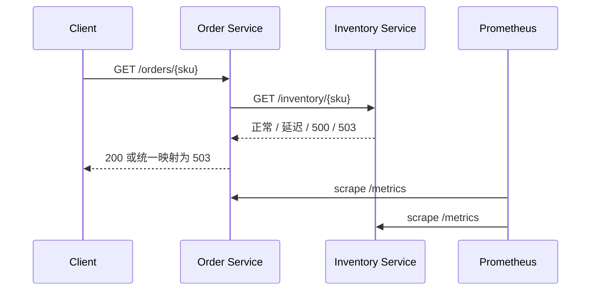
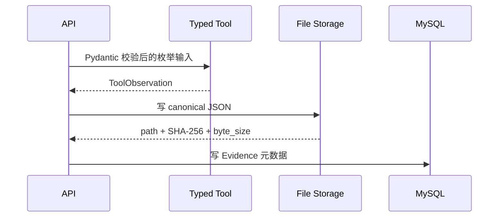
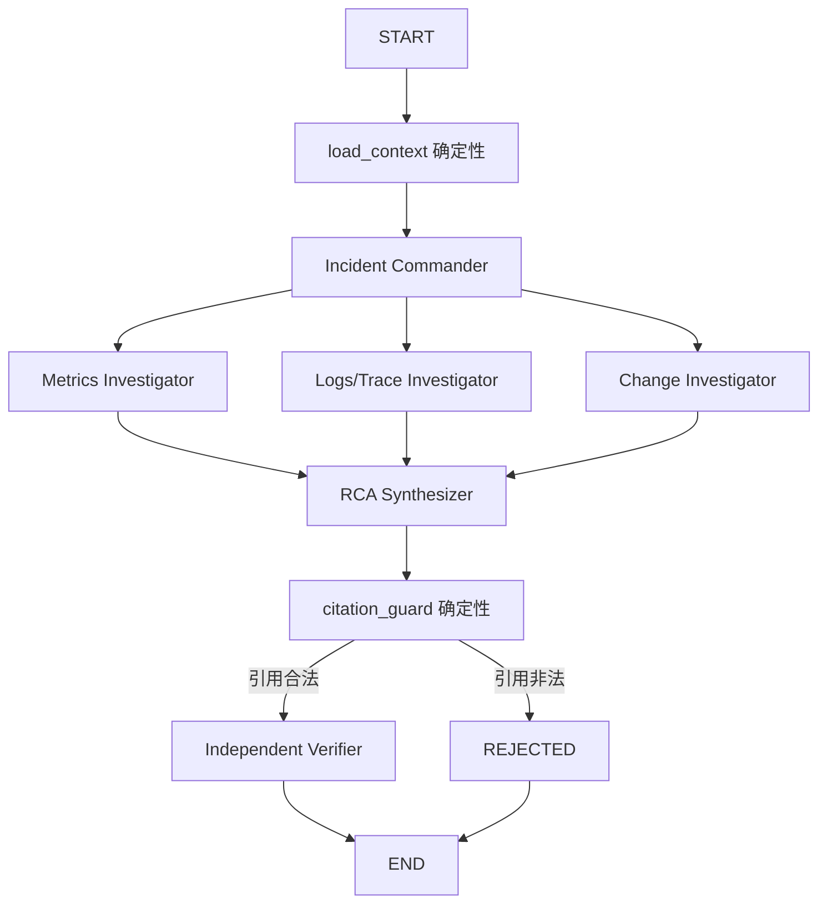
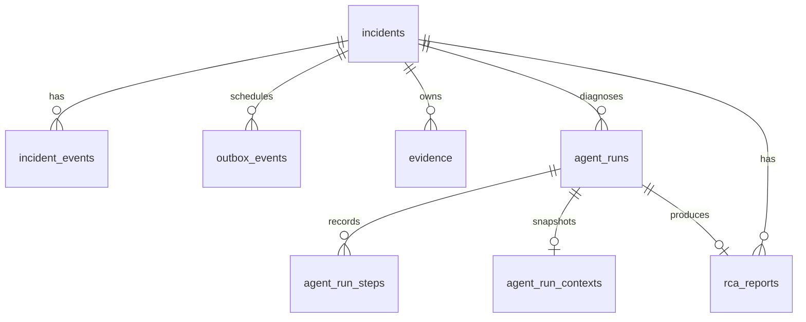

# AxiomOps 从零到 Phase 5：完整技术实现详解

> 本文用于帮助项目作者在一段时间后重新理解 AxiomOps，也可作为面试前的系统复习材料。内容以当前代码和已经保存的黑盒验证记录为准，不把规划中的功能写成已完成能力。

## 1. 项目现在是什么

AxiomOps 是一个面向微服务故障场景的证据驱动多 Agent 诊断系统。当前已经完成 Phase 0–5，能够走通下面这条只读诊断链路：

```text
可重复故障实验
  -> 创建 Incident
  -> 可靠投递调查任务
  -> Typed Tools 采集不可变 Evidence
  -> LangGraph 多 Agent 生成 RCA
  -> 确定性引用校验
  -> Independent Verifier 独立审核
  -> Redis Checkpoint 支持故障续跑
  -> Qdrant 保存已验证历史 RCA
```

当前尚未实现真正的故障恢复动作、人工审批、权限控制、Sandbox、SLO 恢复验证、回滚和前端控制台。这些属于 Phase 6 以后。

真实 DeepSeek API 调用、RCA 质量和延迟也尚未验证，因为当前没有提供 `DEEPSEEK_API_KEY`。项目已经实现生产适配器和缺 Key 失败关闭，但不能把脚本模型的结果当成 DeepSeek 效果。

## 2. 总体设计思路

### 2.1 先证明故障，再让 Agent 推理

项目没有从“写一个会聊天的 Agent”开始，而是先建立带 Ground Truth 的故障实验。原因是：如果没有已知根因、真实请求结果和监控信号，就无法判断 Agent 的结论是否正确，也无法形成可信的简历指标。

开发顺序因此是：

1. Phase 1 构建可重复故障与 Ground Truth。
2. Phase 2 构建可靠 Incident 控制面。
3. Phase 3 构建只读、受控、可追溯的 Evidence。
4. Phase 4 才接入多 Agent RCA。
5. Phase 5 再补可恢复执行、上下文预算和长期记忆。

### 2.2 Agent 只处理不确定性

Agent 擅长分析、归纳、提出假设，但不适合承担必须严格正确的事务和安全判断。因此本项目把职责分成两类：

| 类型 | 当前职责 |
|---|---|
| Agent 节点 | 调查规划、指标分析、日志/Trace 分析、变更分析、RCA 综合、独立验证 |
| 确定性节点 | 幂等、事务、Outbox、工具白名单、哈希校验、引用校验、状态机、Checkpoint 标识、最终持久化 |

审批、恢复执行、SLO 判断和回滚未来也必须是确定性节点，不能让 LLM 自己决定后直接操作生产系统。

### 2.3 每种存储只承担一种清晰职责

| 组件 | 当前职责 | 为什么这样分 |
|---|---|---|
| MySQL | Incident、状态事件、Outbox、Evidence 元数据、Agent Run、步骤、RCA、上下文清单 | 需要事务、约束和最终事实一致性 |
| 文件系统 | 原始 Evidence JSON | 原始日志和指标响应可能较大，文件便于完整保存与哈希验证 |
| Redis | LangGraph Checkpoint | 适合保存短期工作流状态和快速恢复 |
| RocketMQ | 业务级调查任务调度 | 解耦 Incident 创建和后续消费，允许最终一致 |
| Qdrant | 已验证历史 RCA 的可重建向量索引 | 用于相似案例召回，但不作为最终事实源 |
| Prometheus | 实验服务指标 | 提供时间序列证据和故障信号 |

关键原则是：MySQL 里的最终事实不能依赖 Qdrant 才能恢复；Qdrant 索引丢失时可以从已验证 RCA 重建。

## 3. 当前运行架构



项目存在两个 Docker Compose 环境：

- `ops-lab/docker-compose.yml`：Order、Inventory、Prometheus。
- `ops-control-plane/docker-compose.yml`：MySQL、RocketMQ、Redis、Qdrant、API、Relay、Consumer。

二者分离的好处是可以独立验证故障实验和控制面，也可以在 Phase 3 以后同时启动形成端到端链路。

## 4. 目录如何阅读

```text
src/axiom_ops/
├─ app.py                         # Phase 0 最小应用工厂
├─ config.py                      # Phase 0 环境配置
├─ lab/                           # Phase 1 故障实验
│  ├─ app.py                      # Order/Inventory 共用 FastAPI 镜像
│  ├─ faults.py                   # 确定性故障状态
│  ├─ metrics.py                  # Prometheus 指标
│  ├─ scenarios.py                # Ground Truth Schema 与加载
│  └─ scenario_runner.py          # 注入、请求、指标、恢复、产物
└─ control_plane/                 # Phase 2–5 控制面
   ├─ app.py                      # API 组装与端点
   ├─ repository.py               # Incident、Outbox、消费事务
   ├─ relay.py                    # Outbox Relay 循环
   ├─ consumer.py                 # RocketMQ 幂等消费循环
   ├─ typed_tools.py              # Phase 3 只读工具
   ├─ evidence_*.py               # Evidence 元数据、文件和服务层
   ├─ rca_graph.py                # Phase 4 LangGraph
   ├─ rca_model.py                # DeepSeek 结构化适配
   ├─ rca_repository.py           # Agent Run 与 RCA 持久化
   ├─ rca_runtime.py              # Phase 4/5 运行编排
   ├─ checkpoint.py               # RedisSaver 生命周期
   ├─ context_compaction.py       # Evidence Capsule
   └─ rca_memory.py               # FastEmbed + Qdrant

ops-lab/                          # Phase 1 容器和 Prometheus 配置
ops-control-plane/                # Phase 2–5 容器和 SQL 迁移
scripts/                          # 启停、场景和黑盒验证入口
tests/                            # 单元、契约和安全边界测试
docs/                             # 蓝图、验证记录和本手册
artifacts/                        # 本地实验产物，不提交 Git
```

建议以后重新阅读项目时按照 Phase 顺序读，不要先钻进 `rca_graph.py`。Agent 的输入为什么可信，答案都在 Phase 1–3。

## 5. Phase 0：项目骨架与健康检查

### 5.1 目标

Phase 0 的目标不是做业务，而是证明项目能够被安装、配置、启动和测试，为后续阶段建立稳定骨架。

### 5.2 做了什么

- 建立 `src` Layout 的 Python 包。
- 使用 `pyproject.toml` 固定依赖版本和 pytest 配置。
- 建立 FastAPI 应用工厂 `create_app()`。
- 使用 `pydantic-settings` 加载环境变量。
- 提供 `/health` 和 `/ready`。
- 建立最初的健康检查测试。
- 建立 Docker、文档和脚本目录边界。

### 5.3 为什么使用应用工厂

`create_app(settings)` 允许测试传入独立配置，而不是依赖全局环境变量。后续控制面也沿用了同样思路，可以在测试中替换 Repository、Database、EvidenceService 或 RcaRuntime。

### 5.4 配置方法

基础配置使用 `AXIOMOPS_` 前缀，例如：

```text
AXIOMOPS_ENVIRONMENT=development
AXIOMOPS_LOG_LEVEL=INFO
```

控制面配置使用更窄的 `AXIOMOPS_CONTROL_` 前缀，避免 Lab 与控制面变量混在一起。

### 5.5 验证方式

从用户视角验证：

```powershell
.\.venv\Scripts\python.exe -m pytest
.\.venv\Scripts\python.exe -m uvicorn axiom_ops.app:app
Invoke-RestMethod http://127.0.0.1:8000/health
Invoke-RestMethod http://127.0.0.1:8000/ready
```

## 6. Phase 1：可重复故障实验与 Ground Truth

### 6.1 为什么这是整个项目的地基

Agent 项目常见问题是只有一段日志和一个看似合理的回答，却没有已知真相。Phase 1 通过主动注入故障建立确定的根因、预期表现和恢复条件，因此后续可以评价诊断是否有证据支撑。

### 6.2 服务拓扑



Order 和 Inventory 使用同一个镜像，通过环境变量决定角色。这样只维护一套实验服务代码，同时仍能形成真实 HTTP 下游调用。

### 6.3 三种故障

| 场景 | 注入方式 | 用户侧表现 | 主要监控信号 |
|---|---|---|---|
| `inventory_latency` | Inventory 延迟响应 | Order 返回 200，但平均耗时显著增加 | HTTP duration 增量 |
| `inventory_error_rate` | 确定性 500 | Order 映射为 503 | downstream failure 计数增量 |
| `inventory_unavailable` | Inventory 返回 503 | Order 返回 503 | downstream failure 计数增量 |

`FaultState` 使用 `asyncio.Lock` 保护配置和请求计数。错误率不是随机数，而是根据请求序号计算确定性 bucket。这样相同配置下的实验可重复，不会因为随机采样导致验证偶发失败。

### 6.4 Prometheus 指标

Lab 为每个进程建立独立 `CollectorRegistry`，注册：

- HTTP 请求 Counter。
- HTTP 延迟 Histogram。
- Order 下游请求 Counter。
- 当前故障模式 Gauge。

Prometheus 每秒抓取 Order 和 Inventory。场景不是只检查 HTTP 状态，还要求故障模式和指标增量同时满足 Ground Truth。

### 6.5 场景运行器做了什么

`run_scenario()` 的执行顺序是：

1. 重置 Inventory 故障。
2. 发送健康 baseline 请求。
3. 等待 Prometheus 首次抓到 Order 指标时序。
4. 保存 baseline 指标。
5. 注入 Ground Truth 中定义的故障。
6. 发送指定数量的故障请求。
7. 轮询 Prometheus，直到 `active_fault` 和对应信号达到阈值，最长 15 秒。
8. 重置故障。
9. 发送恢复请求，要求全部返回 200。
10. 保存实验输入、请求、指标和最终判断。

这里没有使用固定睡眠作为唯一同步手段。2026-07-09 的完整性审计发现冷启动时 Prometheus 可能尚未完成首次抓取，因此改成等待真实时序和目标信号；如果超时，仍按实际结果失败，不会伪造通过。

### 6.6 每次实验保存什么

```text
artifacts/lab/<run-id>/
├─ ground-truth.json  # 场景定义、已知根因、允许动作和成功条件
├─ requests.json      # 故障期与恢复期每个请求的状态、耗时和响应体
├─ metrics.json       # baseline、observed 和 delta
└─ result.json        # 汇总判断与错误
```

这些产物是未来 Phase 7 做故障集、准确率和消融实验的基础，也是简历数字必须引用的来源。

### 6.7 如何运行

```powershell
.\scripts\start_lab.ps1
.\.venv\Scripts\python.exe scripts\run_scenario.py --all
.\scripts\stop_lab.ps1
```

## 7. Phase 2：MySQL + Transactional Outbox + RocketMQ

### 7.1 要解决的问题

创建 Incident 时，如果先写数据库再发消息，数据库成功而消息失败会丢调查任务；如果先发消息再写数据库，消费者可能看到一个不存在的 Incident。这是典型的数据库与消息队列双写问题。

项目使用 Transactional Outbox：业务事实和待发送消息先在同一个 MySQL 事务中提交，再由独立 Relay 异步发送。

### 7.2 创建 Incident 的事务

`POST /incidents` 接收 `Idempotency-Key` 和结构化请求。Repository 在一个事务中写入：

1. `incidents`：当前状态 `RECEIVED`、版本号和请求指纹。
2. `incident_events`：只追加 `incident.received` 审计事件。
3. `outbox_events`：`incident.investigation.requested` 消息，初始为 `PENDING`。

只有三者全部成功事务才提交。

### 7.3 请求幂等

请求正文会进行稳定 JSON 序列化并计算 SHA-256 指纹：

- 相同 Key、相同指纹：返回原 Incident，不重复写入。
- 相同 Key、不同指纹：返回 `409`，避免调用者误把另一请求当重试。

这比只依赖数据库自增 ID 更符合真实支付、订单和任务创建接口的设计。

### 7.4 Outbox Relay

Relay 周期性执行：

1. 用短事务申请可发送事件。
2. 将事件标记为 `SENDING`，写入 `locked_by/locked_at` 并增加 attempts。
3. 释放数据库事务。
4. 调用 RocketMQ 网络发送。
5. 成功后短事务标记 `PUBLISHED`；失败则恢复为可重试状态并记录错误。

网络发送不放在数据库事务内部，否则慢网络会长时间占用连接和行锁。

租约过期后其他 Relay 可以重新领取事件，因此进程崩溃不会永久卡住 Outbox。

### 7.5 为什么允许重复投递

如果 Relay 已发送成功，但在标记 `PUBLISHED` 前崩溃，它恢复后会再次发送。分布式系统中很难同时原子提交 MySQL 和 RocketMQ，所以这里选择 at-least-once 投递，再由消费者幂等消除副作用。

### 7.6 幂等 Consumer

Consumer 收到消息后，在同一个 MySQL 事务中：

1. 尝试写 `processed_messages`，唯一键为消费组 + event ID。
2. 如果已经存在，说明是重复消息，直接视为已处理。
3. 校验 Incident 当前状态和版本。
4. 将状态从 `RECEIVED` 推进为 `INVESTIGATION_QUEUED`。
5. 追加状态审计事件。
6. 事务提交后才向 RocketMQ ACK。

因此即使消息重复、Consumer 重启或 ACK 丢失，也不会重复推进状态。

### 7.7 Phase 2 数据表

| 表 | 作用 |
|---|---|
| `incidents` | 当前状态、业务字段、版本和幂等信息 |
| `incident_events` | 只追加状态审计链 |
| `outbox_events` | 待发送业务事件、租约、尝试次数、消息 ID 和错误 |
| `processed_messages` | 消费幂等记录 |

### 7.8 黑盒验证

```powershell
.\scripts\start_control_plane.ps1
.\.venv\Scripts\python.exe scripts\verify_control_plane.py
.\scripts\verify_outbox_recovery.ps1
```

第二个脚本会停止 RocketMQ Proxy，在 MQ 不可用时创建 Incident，确认 MySQL 仍可靠落库；恢复 Proxy 后确认 Outbox 自动补发和 Incident 最终推进。

## 8. Phase 3：Typed Tools 与不可变 Evidence

### 8.1 为什么不能让 Agent 任意查询

如果直接把 PromQL、URL 或 Shell 暴露给 LLM，模型可能执行越权查询、读取无关数据或产生不可复现输入。Phase 3 只提供白名单 Typed Tool，Pydantic 在访问外部系统前完成输入校验。

### 8.2 当前两个工具

#### Metrics Snapshot Tool

输入不是任意 PromQL，而是 `MetricSignal` 枚举。代码将枚举映射到固定查询：

- Order 总耗时。
- Order 下游失败。
- Inventory 当前故障。

输出包含执行过的 PromQL、Prometheus 原始响应、采集时间和工具耗时。

#### Service Health Tool

输入只能是 `order-service` 或 `inventory-service`，URL 由配置映射，不接受调用者传入任意地址。输出包含 HTTP 状态和响应体。

### 8.3 Evidence 的保存过程



`ToolObservation` 是统一证据信封，包括 Schema 版本、工具名、Evidence 类型、输入、来源、采集时间、执行耗时和原始 data。

### 8.4 文件写入方法

内容先用稳定字段排序和紧凑分隔符序列化为 UTF-8 canonical JSON，然后计算 SHA-256。

写入使用：

1. 同目录排他创建临时文件。
2. 写入、flush、`fsync`。
3. 使用硬链接创建最终目标，已存在目标时拒绝覆盖。
4. 删除临时文件。

这样可以避免部分写入和静默覆盖已有 Evidence。

### 8.5 为什么 MySQL 只存元数据

原始日志、指标和 Trace 可能很大，不适合全部塞进关系表。MySQL 保存可检索的 ID、类型、来源、路径、哈希和时间；文件保存完整内容。

二者不能共享本地事务，所以采用“先写完整文件，再插入元数据”。如果数据库写失败，最坏情况是留下无引用孤儿文件；不会产生指向缺失文件的有效 Evidence。孤儿文件可以后续扫描清理。

### 8.6 两层不可变保护

1. MySQL Trigger 拒绝 Evidence `UPDATE` 和 `DELETE`。
2. 每次读取文件重新计算 SHA-256，与 MySQL 元数据比较。

如果文件被篡改，API 返回 `409`，而不是把修改后的内容交给 Agent。

### 8.7 API

```text
POST /incidents/{id}/tools/metrics
POST /incidents/{id}/tools/health
GET  /incidents/{id}/evidence
GET  /evidence/{id}/content
```

### 8.8 验证

```powershell
.\.venv\Scripts\python.exe scripts\verify_evidence.py
.\scripts\verify_evidence_immutability.ps1
```

不可变脚本会尝试 SQL 更新、删除和文件篡改，分别证明数据库 Trigger 和读取哈希校验确实工作。

## 9. Phase 4：LangGraph 多 Agent 只读 RCA

### 9.1 为什么使用 LangGraph

项目需要显式状态、并行分支、条件路由、Checkpoint 和 Resume。LangGraph 是唯一核心编排依赖；没有再叠加 AutoGen、CrewAI 等框架，避免无法解释状态和恢复语义。

### 9.2 图结构



### 9.3 State 和并行结果合并

`RcaState` 保存 Incident、Evidence、历史记忆、Plan、当前任务、Findings、Draft、引用错误、Verification 和步骤审计。

`findings` 与 `steps` 使用 `Annotated[..., operator.add]` reducer。Commander 通过 `Send` 为三个 Investigator 创建独立输入分支，LangGraph 完成后把并行结果合并。

### 9.4 每个角色看见什么

- Commander 只看 Incident、Evidence 清单和历史提示，不看完整原始内容。
- Metrics Investigator 只收到 `METRIC_SNAPSHOT` 和 `SERVICE_HEALTH`。
- Logs/Trace Investigator 只允许日志和 Trace 类型。
- Change Investigator 只允许变更类型。
- 当前项目还没有日志、Trace 和变更采集，所以对应角色必须明确报告 Evidence 缺失，不能编造事实。

Commander 生成的问题可以受历史案例启发，但系统会重新按固定角色类型分配 Evidence ID，模型不能自行扩大权限。

### 9.5 Investigator 安全校验

每个 Investigator 返回后，确定性代码检查：

- task ID 和 role 是否与输入一致。
- 引用是否属于分配给该角色的子上下文。
- 没有 Evidence 的角色是否产生了观察、假设或引用。
- 没有 Evidence 时是否明确填写 limitations。

这使“模型声称自己只看了某些证据”变成代码可以验证的权限边界。

### 9.6 RCA 引用安全门

Synthesizer 输出 `RcaDraft` 后，`citation_guard` 会把草稿的 Evidence ID 与当前 Incident 的 Evidence 集合比较。

- 跨 Incident 或不存在的 ID：直接 `REJECTED`，不会调用 LLM Verifier。
- 引用合法：进入 Independent Verifier。

历史 Qdrant 记忆不是 Evidence ID，因此不能通过这个安全门。

### 9.7 Independent Verifier

Verifier 只收到 RCA 草稿和草稿实际引用的 Evidence，而不是全部上下文。它独立检查因果结论、置信度、矛盾和未支撑声明。

如果返回无效引用或 unsupported claims，代码强制把 decision 改为 `REJECTED`。只有 `APPROVED` 才创建 `rca_reports`。

### 9.8 DeepSeek 结构化适配

`DeepSeekRcaModel` 为四类调用分别生成系统提示词和 JSON Schema：

- plan
- investigate
- synthesize
- verify

请求使用 JSON Object 输出，响应必须通过对应 Pydantic Model 校验。以下情况会失败关闭：

- 没有 API Key。
- HTTP 错误或超时。
- 空响应。
- JSON 截断。
- 非法 JSON。
- Schema 不匹配。
- 模型调用预算耗尽。

2026-07-09 审计增加了 `validate_configuration()`：MySQL 创建 Agent Run 后立刻检查 Key。缺 Key 会快速写入 `FAILED` Run，不会先加载 FastEmbed。

### 9.9 Run 与报告持久化

| 表 | 内容 |
|---|---|
| `agent_runs` | 状态、模型、图版本、Evidence 快照、验证、错误、调用数、token、耗时 |
| `agent_run_steps` | 每个图节点的结构化输出 |
| `rca_reports` | 只有 APPROVED 的最终 RCA |

Run 状态：

```text
RUNNING -> COMPLETED
RUNNING -> REJECTED
RUNNING -> FAILED
FAILED  -> RUNNING -> COMPLETED/REJECTED/FAILED  # Phase 5 Resume
```

`rca_reports` 也由 Trigger 禁止更新和删除。

### 9.10 API

```text
POST /incidents/{id}/rca-runs
GET  /rca-runs/{run_id}
GET  /incidents/{id}/rca
```

`verify_rca.py` 使用明确命名的 scripted evaluation model 验证图结构和安全门。它不代表 DeepSeek 效果。

## 10. Phase 5：Checkpoint、上下文预算和长期记忆

### 10.1 Redis Checkpoint

生产环境通过 `RedisSaver.from_conn_string()` 创建 LangGraph Checkpointer，并在首次使用时调用 `setup()` 建立所需索引。

最重要的标识规则是：

```text
LangGraph thread_id == MySQL agent_runs.id
```

这样 Redis 工作流状态和 MySQL 审计 Run 可以直接对应，不需要额外映射表。

Redis 使用 AOF 持久化。验证脚本会让 Synthesizer 人为抛错，得到 `FAILED` Run，重启 Redis 后再用同一 Run ID Resume。

### 10.2 Resume 的执行过程

`POST /rca-runs/{run_id}/resume` 只接受 `FAILED`：

1. MySQL 查询原 Run。
2. 非 `FAILED` 返回 `409`。
3. 将原 Run 恢复为 `RUNNING`，不创建新 Run。
4. 创建同结构 LangGraph，并使用同一 `thread_id` 调用 `invoke(None)`。
5. Redis 恢复已完成状态，只重试失败节点。
6. 模型调用数、token 和耗时与之前累计。
7. 成功后一次性保存完整步骤和最终结果。

黑盒验证中 Commander 只执行 1 次、三个 Investigator 各 1 次；Resume 只重新执行失败的 Synthesizer 和之后节点。

这里的“Resume”是 Agent 工作流续跑，不是执行生产故障恢复。生产恢复动作仍属于 Phase 6。

### 10.3 为什么需要 Evidence Capsule

直接把全部原始 Evidence 塞入 Prompt 会导致上下文过长、成本不可控，也可能让原始响应中的噪声淹没重要信息。

`compact_evidence()` 用确定性代码生成 Capsule，而不是让 LLM 摘要。每条 Capsule 必须保留：

- Evidence ID。
- kind。
- source。
- observed_at。
- content SHA-256。
- 有预算的关键内容。

指标证据只抽取工具、输入、耗时、PromQL 和 result；健康证据保留状态和响应体；其他类型使用通用有界 JSON。

内容过长时保留头尾并插入截断标记。随后按最长内容逐步缩减，直到所有 Capsules 的总字符数不超过配置预算。若连元数据都放不下，则显式抛出 `ContextBudgetError`。

### 10.4 上下文清单为何写 MySQL

`agent_run_contexts` 保存：

- original bytes。
- compacted bytes。
- 实际 Capsules JSON。
- 创建时间。

这使一次 RCA 到底看到了什么可审计、可复现。该表也有 Trigger 禁止更新和删除。

### 10.5 Qdrant 长期记忆

`RcaMemoryStore` 使用 FastEmbed 多语言模型生成 384 维向量，并把已验证 RCA 写入 Qdrant。向量文本由 Incident 服务、级别、标题、摘要、RCA 摘要和根因组成。

Payload 保存 report/run/incident ID、服务、级别、摘要、根因、限制、Evidence IDs 和 `verified=true`。

查询时：

- 只查同服务。
- 只查 `verified=true`。
- 排除当前 Incident。
- 返回 Top-K 相似历史 RCA。
- 集合为空时直接返回，不初始化 embedding 推理。

### 10.6 为什么历史记忆不是 Evidence

历史 RCA 可以帮助 Commander 想到调查方向，但它可能属于不同时间、版本和环境。项目给每条召回结果添加：

```text
historical hint only; not citable Evidence
```

历史提示只传给 Commander；Investigator、Synthesizer 和 Verifier不会直接收到它。即使模型尝试引用历史 report ID，Citation Guard 也只接受当前 Incident 的 Evidence ID。

### 10.7 Qdrant 故障为什么不回滚 RCA

RCA 先提交 MySQL，再尽力写 Qdrant。索引失败只记录 warning，不把已验证 RCA 改成失败。

这是因为：

- MySQL RCA 是最终事实。
- Qdrant 是可重建派生索引。
- 不能因为缓存/索引故障篡改已经通过验证的业务结果。

### 10.8 Phase 5 API

```text
POST /rca-runs/{run_id}/resume
```

其余 RCA 查询接口沿用 Phase 4，并在 `RcaRunView` 中增加 context 清单。

## 11. 一次完整业务流如何发生

下面把 Phase 1–5 串成一次完整流程。

### 第一步：制造一个可证明的故障

场景运行器给 Inventory 注入延迟、错误或不可用，向 Order 发请求，并保存 Ground Truth、请求与指标。

### 第二步：创建 Incident

调用 `POST /incidents`。MySQL 同一事务保存 Incident、审计事件和 Outbox。API 返回后，即使 RocketMQ 暂时不可用，Incident 也不会丢失。

### 第三步：业务调度

Relay 领取 Outbox 并投递 RocketMQ。Consumer 幂等消费后将 Incident 推进到 `INVESTIGATION_QUEUED`。

### 第四步：采集 Evidence

调用 Metrics 和 Health Typed Tools。工具读取真实 Prometheus 和服务健康端点，原始 Observation 写文件，元数据和 SHA-256 写 MySQL。

### 第五步：创建 RCA Run

Runtime 创建 MySQL `agent_runs`，固化本次 Evidence ID 快照，校验模型配置和 Evidence 文件哈希，生成 Evidence Capsules，并查询历史已验证 RCA。

### 第六步：多 Agent 调查

Commander 规划三个任务。LangGraph 并行执行 Metrics、Logs/Trace、Change Investigator。缺少证据的角色只能报告限制。

### 第七步：综合与双重验证

Synthesizer 生成 RCA 草稿。确定性 Citation Guard 先检查引用，再由 Independent Verifier 审核结论是否被证据支持。

### 第八步：保存结果

- APPROVED：Run 变为 `COMPLETED`，创建不可变 RCA Report。
- Verifier 或引用门拒绝：Run 变为 `REJECTED`，不创建 Report。
- 模型、Evidence、Checkpoint 等异常：Run 变为 `FAILED`，保存错误。

### 第九步：索引长期记忆

只有 APPROVED Report 才写入 Qdrant。未来同服务 Incident 可以召回，但只能作为调查提示。

### 第十步：失败续跑

如果 Agent 节点失败，Redis 保留 Checkpoint。修复外部条件后调用 Resume，以同一 Run ID 从失败点继续。

## 12. 数据模型关系



理解数据表时要区分三类信息：

- 当前状态：`incidents`、`agent_runs`。
- 只追加/不可变审计：`incident_events`、`agent_run_steps`、`agent_run_contexts`、`rca_reports`。
- 可靠性辅助：`outbox_events`、`processed_messages`。

## 13. API 总览

| 方法 | 路径 | 用途 |
|---|---|---|
| GET | `/health` | 进程存活 |
| GET | `/ready` | MySQL Schema 就绪 |
| POST | `/incidents` | 幂等创建 Incident |
| GET | `/incidents/{id}` | Incident、事件和 Outbox 状态 |
| POST | `/incidents/{id}/tools/metrics` | 采集指标 Evidence |
| POST | `/incidents/{id}/tools/health` | 采集健康 Evidence |
| GET | `/incidents/{id}/evidence` | Evidence 元数据列表 |
| GET | `/evidence/{id}/content` | 验哈希后读取原始 Evidence |
| POST | `/incidents/{id}/rca-runs` | 同步启动一次 RCA Run |
| GET | `/rca-runs/{run_id}` | Run 状态、步骤、验证和上下文 |
| POST | `/rca-runs/{run_id}/resume` | 续跑 FAILED Run |
| GET | `/incidents/{id}/rca` | 最近一份已验证 RCA |

## 14. 验证体系

### 14.1 单元与契约测试

当前全量结果是：

```text
31 passed
```

测试重点不是追求覆盖率数字，而是锁定关键边界：

- 配置和健康端点。
- 故障状态和 Ground Truth 判断。
- Prometheus 冷启动轮询。
- Incident 请求 Schema。
- Typed Tool 输入和错误。
- Evidence 原子写入与哈希篡改。
- LangGraph 并行、引用越界和无证据幻觉。
- DeepSeek JSON 适配和缺 Key 失败关闭。
- Evidence Capsule 预算。
- Redis Resume 不重复节点。
- 空 Qdrant 集合不加载 embedding。
- 已验证 RCA 召回和当前 Incident 排除。

### 14.2 黑盒脚本

| 脚本 | 验证内容 |
|---|---|
| `run_scenario.py --all` | Phase 1 三类故障与恢复 |
| `verify_control_plane.py` | Incident 幂等、Outbox、消费闭环 |
| `verify_outbox_recovery.ps1` | RocketMQ 中断与最终恢复 |
| `verify_evidence.py` | 真实 Typed Tools 和 Evidence |
| `verify_evidence_immutability.ps1` | SQL 不可变与文件篡改 |
| `verify_rca.py` | 多 Agent、引用门、Verifier、持久化 |
| `verify_rca_missing_key.py` | 缺 Key 快速 FAILED |
| `verify_phase5.py` | Checkpoint、Resume、Qdrant 和 REJECTED 隔离 |

### 14.3 为什么脚本模型不等于生产模型

Scripted Model 用于稳定验证工作流、并行、引用和持久化，它的输出是预先受控的。真实 DeepSeek 还需要单独的故障集评测，至少测：

- RCA 根因命中率。
- 引用完整率。
- 无证据声明率。
- Verifier 通过/拒绝质量。
- token 和模型调用数。
- P50/P95 端到端延迟。

这些数字必须来自保存报告后才能写入简历。

## 15. 从零运行 Phase 0–5

### 15.1 安装

```powershell
python -m venv .venv
.\.venv\Scripts\python.exe -m pip install -e ".[dev]"
.\.venv\Scripts\python.exe -m pytest
```

### 15.2 启动 Lab

```powershell
.\scripts\start_lab.ps1
.\.venv\Scripts\python.exe scripts\run_scenario.py --all
```

### 15.3 启动控制面

```powershell
.\scripts\start_control_plane.ps1
.\.venv\Scripts\python.exe scripts\verify_control_plane.py
```

### 15.4 验证 Evidence 和 RCA

```powershell
.\.venv\Scripts\python.exe scripts\verify_evidence.py
.\.venv\Scripts\python.exe scripts\verify_rca.py
.\.venv\Scripts\python.exe scripts\verify_rca_missing_key.py
```

### 15.5 停止但保留数据

```powershell
.\scripts\stop_control_plane.ps1
.\scripts\stop_lab.ps1
```

不要随意执行 `down -v`，因为它会删除 MySQL、Evidence、Redis 和 Qdrant 数据卷。只有明确需要从空数据库重新初始化时才使用。

## 16. 常见故障如何定位

### 16.1 `/ready` 返回 503

检查：

1. MySQL 是否 healthy。
2. `mysql-migrate` 是否成功退出。
3. `agent_run_contexts` 等迁移表是否存在。
4. 控制面使用的数据库地址是否为容器内 `mysql:3306`，而不是宿主端口。

### 16.2 Incident 一直是 `RECEIVED`

依次检查：

1. Outbox 是否仍为 `PENDING/SENDING`。
2. Proxy、Broker、Namesrv 是否运行。
3. Relay 日志是否反复重试。
4. Consumer 是否运行。
5. `processed_messages` 是否已有事件记录。

### 16.3 Evidence 返回 409

这通常不是普通 API 错误，而是文件缺失、路径逃逸或 SHA-256 不一致。检查 MySQL 的 `artifact_path/content_sha256` 和 Evidence 文件卷。

### 16.4 RCA 变成 `REJECTED`

查看 `verification` 与 steps：

- `reject_citations`：草稿引用不属于当前 Incident。
- `verifier`：Independent Verifier 发现无效引用、未支撑声明或其他问题。

REJECTED 是安全门正常工作，不等同于系统异常。

### 16.5 RCA 变成 `FAILED`

查看 `error`：

- `DEEPSEEK_API_KEY is not configured`：当前预期行为。
- Evidence hash mismatch：证据完整性失败。
- ContextBudgetError：预算小于必要元数据。
- 模型 HTTP/JSON/Schema 错误：生产模型适配失败关闭。
- Redis 错误：Checkpoint 不可用。

### 16.6 Resume 返回 409

只有 `FAILED` Run 可以 Resume。`COMPLETED`、`REJECTED` 或仍在 `RUNNING` 的 Run 都会拒绝，避免重复完成和并发续跑。

## 17. 重要设计取舍

### 17.1 为什么不是 Kafka

项目固定使用 RocketMQ，以复用 Java 后端常见消息体系，并展示 Outbox、租约、重试和幂等。重点不是 MQ 品牌，而是可靠消息语义。

### 17.2 为什么不是 PostgreSQL + pgvector

MySQL 用于复用已有后端能力，Qdrant 专门负责向量索引。这样最终事实和可重建搜索索引边界更清楚。

### 17.3 为什么不使用 Neo4j

当前微服务拓扑很小，没有必要为了“看起来高级”引入图数据库。后续服务目录可以用普通结构化数据表示，直到真实查询复杂度证明需要图数据库。

### 17.4 为什么不叠加多个 Agent 框架

LangGraph 已经提供 StateGraph、并行、条件路由、Checkpoint 和 Resume。叠加框架会让状态所有权和错误恢复更难解释，不利于面试。

### 17.5 为什么当前 RCA API 是同步的

Phase 4/5 为了最小闭环使用同步执行，便于直接验证完整结果。真实模型可能耗时较长，后续可以让 RocketMQ 启动 Run、SSE 推送进度，但这属于后续阶段，当前没有提前铺设。

## 18. 当前明确的限制

- Logs/Trace Investigator 和 Change Investigator 目前没有对应采集工具，只会报告限制。
- 没有真实告警入口，Incident 由 API/脚本创建。
- 没有 OpenTelemetry 跨服务 Trace，属于 Phase 7。
- 没有真实 DeepSeek 质量评测。
- 没有 RBAC、审批、命令 Sandbox、恢复动作和回滚。
- 没有 React 控制台和 SSE。
- Qdrant 失败只记录日志，尚未实现后台重建任务。
- 进程被强制终止时，长期 `RUNNING` Run 的租约/看门狗尚未实现。

限制必须在面试中主动说明。一个边界清楚、能解释失败模式的项目，比声称什么都有却无法证明更可信。

## 19. 建议的重新学习顺序

如果以后忘记项目细节，按下面顺序恢复记忆：

1. 读 `docs/architecture.md` 和本文第 1–3 节，理解边界。
2. 运行 Phase 1 三场景，查看一个 `artifacts/lab` 目录。
3. 读 `repository.py`，理解 Incident + Outbox + Consumer 三个事务。
4. 读 `typed_tools.py`、`evidence_storage.py`，理解证据可信链。
5. 读 `rca_graph.py`，手画节点和每个角色可见输入。
6. 读 `rca_runtime.py`，理解图外的持久化、Checkpoint 和记忆。
7. 运行所有验证脚本，对照 `docs/phase-*-validation.md`。
8. 最后再准备面试话术和简历数字。

## 20. 面试时如何概括

可以先用一句话说明：

> AxiomOps 不是一个只会调用 LLM 的 Demo，而是一套先用 Ground Truth 故障实验建立评测基础，再用 MySQL Outbox、不可变 Evidence、LangGraph 多 Agent、确定性引用门、Redis Checkpoint 和 Qdrant 已验证记忆形成可审计诊断闭环的系统。

如果面试官继续追问，按这条主线展开：

1. 故障是否真实、可重复。
2. Incident 和消息是否可靠。
3. Agent 输入是否受控、可追溯。
4. 多 Agent 是否真正并行且上下文隔离。
5. 幻觉和越权引用如何被确定性拒绝。
6. 运行中断后如何恢复。
7. 长期记忆为什么不会污染证据。
8. 哪些结果是真实测试，哪些仍待 DeepSeek Key 验证。

## 21. 相关文档

- [架构基线](architecture.md)：稳定架构边界。
- [执行路线](execution-roadmap.md)：Phase 路线。
- [Phase 2 蓝图](phase-2-blueprint.md)：Incident/Outbox 设计。
- [Phase 3 蓝图](phase-3-blueprint.md)：Typed Tools/Evidence 设计。
- [Phase 4 蓝图](phase-4-blueprint.md)：多 Agent RCA 设计。
- [Phase 5 蓝图](phase-5-blueprint.md)：Checkpoint/Memory 设计。
- [Phase 1–5 完整性审计](phase-1-5-audit.md)：最新完整性复审。
- 各阶段的 `phase-*-validation.md`：真实验证记录。
