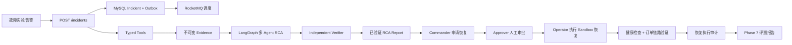
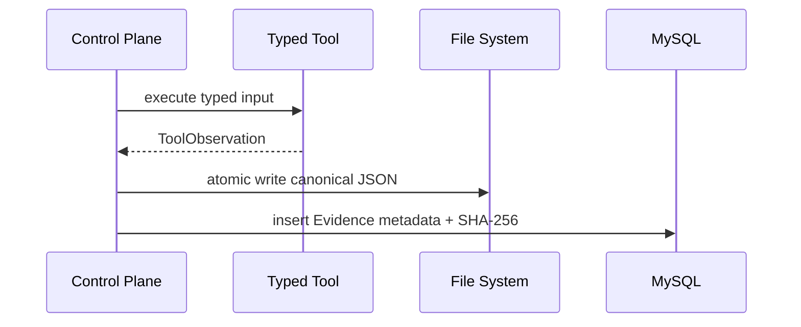

# AxiomOps 从零到 Phase 7：完整技术实现详解

本文档用于以后快速恢复项目上下文，也用于面试前复盘。它解释 AxiomOps 到 Phase 7 为止做了什么、为什么这样做、每一步怎么验证，以及哪些能力仍不能写成真实模型指标。

## 1. 项目定位

AxiomOps 是一个面向微服务故障场景的证据驱动多 Agent 智能诊断与安全恢复系统。它不是“调用一次大模型生成答案”的 Demo，而是把故障实验、可靠控制面、不可变证据、多 Agent RCA、人工审批、安全恢复和量化评测串成闭环。

面试叙事可以压缩成一句话：

> AxiomOps 先用可重复 Ground Truth 故障实验建立评测基础，再通过 MySQL Outbox、不可变 Evidence、LangGraph 多 Agent、Redis Checkpoint、Qdrant 已验证记忆、审批式 Sandbox 恢复和 Prometheus 评测报告，形成一套可审计、可恢复、可量化的 AIOps Agent 系统。

当前完成阶段：

| Phase | 主题 | 状态 |
| --- | --- | --- |
| Phase 0 | 项目骨架、健康检查、基础测试 | completed |
| Phase 1 | 可重复微服务故障实验和 Ground Truth | completed |
| Phase 2 | MySQL + Transactional Outbox + RocketMQ Incident 控制面 | completed |
| Phase 3 | Typed Tools 与不可变 Evidence | completed |
| Phase 4 | LangGraph 多 Agent 只读 RCA | completed |
| Phase 5 | Redis Checkpoint、上下文压缩、Qdrant 已验证记忆 | completed |
| Phase 6 | 权限、人工审批、Sandbox 恢复验证与回滚 | completed |
| Phase 7 | Prometheus/Trace、故障集与消融实验 | completed |

仍未完成或不能夸大：

- 未提供 DeepSeek Key，因此真实 DeepSeek 质量、延迟、成本评测仍未执行。
- Phase 7 的消融实验评估的是确定性工程门禁，不是模型推理能力。
- 当前 Trace 是基于 `traceparent` 和 `X-AxiomOps-Trace-Id` 的最小可追踪实现，没有接 Jaeger/Tempo。
- 前端 React 控制台属于后续 Phase 8。

## 2. 最终技术栈

| 层级 | 技术 | 作用 |
| --- | --- | --- |
| Agent Runtime | Python、FastAPI、LangGraph、DeepSeek Adapter | 诊断编排、结构化 LLM 调用、API 控制面 |
| 最终事实源 | MySQL | Incident、Evidence 元数据、Agent Run、RCA、审批、执行、Outbox |
| 短期状态 | Redis | LangGraph Checkpoint、续跑状态 |
| 可靠消息 | RocketMQ | Incident 调度与业务消息投递 |
| 长期记忆 | Qdrant | 只索引已验证 RCA，作为 Commander 的历史提示 |
| 观测与实验 | Prometheus、Docker Compose、Trace Header | 指标采集、故障实验、控制面观测 |
| 实验服务 | Order Service、Inventory Service | 可重复故障注入与恢复验证 |

明确不使用 PostgreSQL、pgvector、Kafka、Neo4j、Spring AI 或额外多 Agent 框架。这样做是为了降低面试解释成本，保持状态所有权清晰。

## 3. 总体业务闭环



核心边界：

- Agent 只做诊断、规划和证据归纳。
- 写操作、审批、执行、回滚、幂等、重试、验证都由确定性控制面负责。
- 历史记忆不是 Evidence，不能被 Synthesizer 当成当前事故证据引用。

## 4. 数据职责

| 数据 | 存放位置 | 设计原因 |
| --- | --- | --- |
| Incident 当前状态、事件、Outbox | MySQL | 需要事务和幂等约束 |
| Evidence 元数据 | MySQL | 需要可检索、可关联 Incident |
| Evidence 原始内容 | 文件系统卷 | 原始响应可能较大，适合文件存储 |
| Agent Run、步骤、RCA Report | MySQL | 最终审计事实 |
| LangGraph Checkpoint | Redis | 支持失败后同 Run 续跑 |
| Evidence Capsule | MySQL | 上下文压缩结果可审计 |
| 已验证 RCA 向量 | Qdrant | 可重建索引，不作为最终事实 |
| 恢复审批和执行 | MySQL | 安全审计、不可变执行记录 |
| 实验产物和评测报告 | `artifacts/` | 简历数字必须来自保存报告 |

## 5. 目录结构

```text
src/axiom_ops/
  app.py                         # Phase 0 基础健康检查
  lab/
    app.py                       # Order/Inventory 实验服务
    faults.py                    # 故障模式与请求计数
    metrics.py                   # Lab Prometheus 指标
    scenario_runner.py           # 故障注入、请求、恢复、产物
  control_plane/
    app.py                       # Incident/RCA/Recovery API
    repository.py                # Incident + Outbox
    evidence_*.py                # Evidence 文件与元数据
    typed_tools.py               # Prometheus/Health 只读工具
    rca_graph.py                 # LangGraph 多 Agent 图
    rca_runtime.py               # Run 生命周期、Checkpoint、Memory
    rca_repository.py            # Agent Run 和 RCA 持久化
    context_compaction.py        # Evidence Capsule
    rca_memory.py                # Qdrant 已验证记忆
    checkpoint.py                # Redis Checkpoint
    recovery_*.py                # Phase 6 审批、执行、回滚
    observability.py             # Phase 7 metrics 和 trace
  evaluation/
    phase7_report.py             # 故障集与消融评测报告

ops-lab/
  docker-compose.yml
  prometheus/prometheus.yml
  scenarios/*.json

ops-control-plane/
  docker-compose.yml
  mysql/001_init.sql ... 005_phase6.sql

scripts/
  run_scenario.py
  verify_control_plane.py
  verify_evidence.py
  verify_rca.py
  verify_phase5.py
  verify_phase6.py
  run_phase7_evaluation.py
```

## 6. Phase 0：项目骨架与健康检查

Phase 0 建立最小 FastAPI 应用、配置加载、健康检查和测试入口。

黑盒验证：

```powershell
.\.venv\Scripts\python.exe -m pytest tests\test_health.py
```

价值：

- 证明项目可安装、可运行、可测试。
- 为后续控制面 `create_app(settings)` 风格打基础，方便测试中注入假的 Repository 或 Runtime。

## 7. Phase 1：可重复故障实验

Phase 1 构建两个微服务：

- `order-service`：对外接收订单请求，依赖库存服务。
- `inventory-service`：支持故障注入。

故障模式：

| 场景 | 注入方式 | 预期 |
| --- | --- | --- |
| `inventory_latency` | 库存响应延迟 800ms | 订单仍返回 200，但平均延迟升高 |
| `inventory_error_rate` | 库存确定性 5xx | 订单返回 503 |
| `inventory_unavailable` | 库存不可用 | 订单返回 503 |

Prometheus 每秒抓取：

- HTTP 请求数。
- HTTP 请求耗时。
- 下游调用状态。
- 当前故障模式。

运行：

```powershell
.\scripts\start_lab.ps1
.\.venv\Scripts\python.exe scripts\run_scenario.py --all
```

每次场景保存：

```text
artifacts/lab/<run-id>/
  ground-truth.json
  requests.json
  metrics.json
  result.json
```

关键修复：

- 冷启动时 Prometheus 可能尚未完成首次 scrape。
- 已改为等待真实时序出现，并轮询故障指标达到阈值，避免固定 sleep 导致假阴性。

## 8. Phase 2：MySQL + Outbox + RocketMQ 控制面

Phase 2 解决“API 已返回但消息没发出去”的可靠性问题。

创建 Incident 时，同一 MySQL 事务写入：

1. `incidents`
2. `incident_events`
3. `outbox_events`

Outbox Relay 后台发送 RocketMQ 消息。发送失败时保留 `PENDING` 并重试；消费者通过 `processed_messages` 幂等处理。

验证：

```powershell
.\scripts\start_control_plane.ps1
.\.venv\Scripts\python.exe scripts\verify_control_plane.py
.\scripts\verify_outbox_recovery.ps1
```

面试要点：

- MySQL 和 RocketMQ 不能共享本地事务。
- 所以采用 Transactional Outbox + at-least-once 投递 + 消费端幂等。
- RocketMQ 暂停期间 API 仍能落库，恢复后自动补发。

## 9. Phase 3：Typed Tools 与不可变 Evidence

Agent 不能直接随意访问外部系统，必须通过白名单 Typed Tool。

当前工具：

| 工具 | 输入 | 输出 |
| --- | --- | --- |
| `prometheus.metrics.snapshot` | 枚举信号 | Prometheus 原始响应 |
| `http.service.health` | 枚举服务名 | 服务健康检查响应 |

Evidence 保存流程：



不可变性：

- Evidence 原始内容以 canonical JSON 写入文件。
- MySQL 保存路径、字节数、SHA-256。
- 数据库 Trigger 拒绝 Evidence `UPDATE` 和 `DELETE`。
- 读取 Evidence 内容时重新计算哈希，不一致返回 `409`。

验证：

```powershell
.\.venv\Scripts\python.exe scripts\verify_evidence.py
.\scripts\verify_evidence_immutability.ps1
```

## 10. Phase 4：LangGraph 多 Agent 只读 RCA

Phase 4 开始真正的多 Agent 诊断，但仍然只读。

Agent 角色：

- Incident Commander
- Metrics Investigator
- Logs/Trace Investigator
- Change Investigator
- RCA Synthesizer
- Independent Verifier

图结构：

```text
load_context
  -> commander
  -> parallel investigate (metrics/logs/change)
  -> synthesize
  -> citation_guard
  -> verifier
  -> finish
```

安全门：

- 每个 Investigator 只能看到自己角色允许的 Evidence。
- 没有 Evidence 的角色必须写 limitation，不能编造观察。
- Synthesizer 的每个 causal claim 必须引用当前 Incident 的 Evidence ID。
- Citation Guard 先做确定性引用校验，再进入 Verifier。
- Verifier 批准后才生成不可变 RCA Report。

DeepSeek 边界：

- 已实现 DeepSeek JSON Adapter 和结构化 Pydantic 校验。
- 未提供 Key 时，运行会 fail fast，Agent Run 标记 `FAILED`。
- 当前验证脚本使用明确标记的 scripted model，不冒充真实 DeepSeek 效果。

验证：

```powershell
.\.venv\Scripts\python.exe scripts\verify_rca.py
.\.venv\Scripts\python.exe scripts\verify_rca_missing_key.py
```

## 11. Phase 5：Checkpoint、上下文预算与已验证记忆

Phase 5 解决三个工程问题：

1. Agent Run 失败后如何恢复。
2. Evidence 太长时如何控制上下文预算。
3. 历史 Incident 如何作为参考但不污染证据。

Redis Checkpoint：

- MySQL `agent_runs.id` 等于 LangGraph `thread_id`。
- `POST /rca-runs/{run_id}/resume` 只允许 `FAILED` Run。
- Resume 不创建新 Run，而是在同一 Run 上恢复。
- 已完成节点不重复执行。

Evidence Capsule：

- 由确定性代码生成，不用 LLM 改写。
- 保留 Evidence ID、kind、source、observed_at、SHA-256。
- 保存原始字节数、压缩后字节数和 capsule 列表。

Qdrant 记忆：

- 只索引 Independent Verifier 批准的 RCA。
- Rejected/Failed Run 不进入记忆。
- 历史记忆只给 Commander 做 hint，不是当前 Evidence。
- Citation Guard 不接受历史 report ID 作为 Evidence ID。

验证：

```powershell
docker compose -f ops-control-plane/docker-compose.yml exec -T control-plane python scripts/verify_phase5.py fail
docker compose -f ops-control-plane/docker-compose.yml exec -T control-plane python scripts/verify_phase5.py resume
docker compose -f ops-control-plane/docker-compose.yml exec -T control-plane python scripts/verify_phase5.py check-memory
docker compose -f ops-control-plane/docker-compose.yml exec -T control-plane python scripts/verify_phase5.py reject
```

## 12. Phase 6：权限、人工审批、Sandbox 恢复验证与回滚

Phase 6 把已验证 RCA 接到安全恢复闭环。重点不是多做恢复动作，而是证明写操作不会被 Agent 直接执行。

角色：

| 角色 | 权限 |
| --- | --- |
| `commander` | 创建恢复申请 |
| `approver` | 审批恢复申请，不能审批自己发起的申请 |
| `operator` | 执行已审批恢复 |

Header：

```text
X-AxiomOps-User: alice
X-AxiomOps-Role: commander | approver | operator
```

当前恢复动作：

```text
reset_inventory_fault
```

执行流程：

1. 读取恢复前故障状态。
2. 执行 `POST /admin/faults/reset`。
3. 验证库存健康和订单链路。
4. 成功则记录 `SUCCEEDED`。
5. 验证失败或异常则记录 `FAILED`/`ROLLED_BACK` 和 rollback 尝试。
6. 同一审批重复执行返回同一执行记录，避免重复写操作。

数据库：

- `recovery_approvals`
- `recovery_executions`

`recovery_executions` 由 Trigger 拒绝更新和删除，是不可变执行审计。

验证：

```powershell
.\.venv\Scripts\python.exe scripts\verify_phase6.py
```

已验证结果：

- 自审批返回 `403`。
- Sandbox 恢复成功。
- 库存健康检查和订单链路均返回 200。
- 重复执行保持幂等。

## 13. Phase 7：可观测性、故障集与消融实验

Phase 7 让项目可以量化，不再只是“看起来能跑”。

控制面新增：

- `/metrics`
- `X-AxiomOps-Trace-Id`
- W3C `traceparent`

控制面 Prometheus 指标：

| 指标 | 含义 |
| --- | --- |
| `axiomops_control_http_requests_total` | 控制面 HTTP 请求计数 |
| `axiomops_control_http_request_duration_seconds` | 控制面 HTTP 请求耗时 |
| `axiomops_control_business_events_total` | Incident/RCA/Recovery 业务事件计数 |

Prometheus 增加 scrape job：

```yaml
job_name: axiomops-control-plane
targets:
  - host.docker.internal:18000
```

Trace 逻辑：

- 请求带合法 `traceparent` 时复用 trace id。
- 否则生成新的 trace id。
- 响应返回 `X-AxiomOps-Trace-Id` 和新的 `traceparent`。

评测脚本：

```powershell
.\.venv\Scripts\python.exe scripts\run_phase7_evaluation.py
```

输出：

```text
artifacts/evaluations/phase7-<timestamp>.json
```

报告指标：

| 指标 | 含义 |
| --- | --- |
| `closed_loop_pass_rate` | 全门禁通过率 |
| `prometheus_evidence_coverage` | Prometheus 证据覆盖率 |
| `recovery_verification_rate` | 恢复验证通过率 |

消融实验：

| 实验 | 去掉什么 | 风险 |
| --- | --- | --- |
| `full_pipeline` | 不去门禁 | 最严格 |
| `without_prometheus_evidence_gate` | 去掉指标证据门禁 | HTTP-only 不能证明故障被观测到 |
| `without_recovery_verification_gate` | 去掉恢复验证门禁 | RCA 通过不代表服务恢复 |

已验证黑盒结果：

```json
{
  "scenario_count": 3,
  "metrics": {
    "closed_loop_pass_rate": 1.0,
    "prometheus_evidence_coverage": 1.0,
    "recovery_verification_rate": 1.0
  }
}
```

三个场景均通过：

- `inventory_error_rate`
- `inventory_latency`
- `inventory_unavailable`

## 14. API 清单

| 方法 | 路径 | 用途 |
| --- | --- | --- |
| `GET` | `/health` | 存活检查，返回 trace header |
| `GET` | `/ready` | MySQL schema 就绪检查 |
| `GET` | `/metrics` | 控制面 Prometheus 指标 |
| `POST` | `/incidents` | 幂等创建 Incident |
| `GET` | `/incidents/{id}` | 查询 Incident、事件、Outbox |
| `POST` | `/incidents/{id}/tools/metrics` | 采集 Prometheus Evidence |
| `POST` | `/incidents/{id}/tools/health` | 采集服务健康 Evidence |
| `GET` | `/incidents/{id}/evidence` | Evidence 元数据列表 |
| `GET` | `/evidence/{id}/content` | 校验哈希后读取 Evidence 原始内容 |
| `POST` | `/incidents/{id}/rca-runs` | 启动 RCA Run |
| `GET` | `/rca-runs/{run_id}` | 查看 Agent Run |
| `POST` | `/rca-runs/{run_id}/resume` | 续跑 FAILED Run |
| `GET` | `/incidents/{id}/rca` | 获取最近已验证 RCA |
| `POST` | `/incidents/{id}/recovery-approvals` | 申请恢复 |
| `GET` | `/recovery-approvals/{id}` | 查看审批 |
| `POST` | `/recovery-approvals/{id}/approve` | 人工审批 |
| `POST` | `/recovery-approvals/{id}/execute` | 执行已审批恢复 |
| `GET` | `/recovery-executions/{id}` | 查看恢复执行审计 |

## 15. 运行顺序

首次启动：

```powershell
python -m venv .venv
.\.venv\Scripts\python.exe -m pip install -e ".[dev]"
.\scripts\start_lab.ps1
.\scripts\start_control_plane.ps1
```

完整基础测试：

```powershell
.\.venv\Scripts\python.exe -m pytest
.\.venv\Scripts\python.exe -m compileall -q src scripts
.\.venv\Scripts\python.exe -m pip check
docker compose -f ops-control-plane\docker-compose.yml config --quiet
docker compose -f ops-lab\docker-compose.yml config --quiet
```

阶段验证脚本：

| 脚本 | 验证 |
| --- | --- |
| `scripts/run_scenario.py --all` | Phase 1 三类故障 |
| `scripts/verify_control_plane.py` | Phase 2 Incident + Outbox 正常流 |
| `scripts/verify_outbox_recovery.ps1` | Phase 2 RocketMQ 中断恢复 |
| `scripts/verify_evidence.py` | Phase 3 Evidence |
| `scripts/verify_evidence_immutability.ps1` | Phase 3 不可变性 |
| `scripts/verify_rca.py` | Phase 4 RCA |
| `scripts/verify_rca_missing_key.py` | DeepSeek Key 缺失 fail-closed |
| `scripts/verify_phase5.py` | Phase 5 Resume/Memory |
| `scripts/verify_phase6.py` | Phase 6 安全恢复 |
| `scripts/run_phase7_evaluation.py` | Phase 7 故障集与消融实验 |

## 16. 面试高频解释

### 16.1 为什么 Agent 不直接执行恢复？

因为 LLM 输出具有不确定性。AxiomOps 把 RCA 和恢复执行拆开：Agent 提供证据支撑的诊断，恢复必须经过角色权限、人工审批、确定性执行器、验证和审计。这样避免“模型一句话改生产”的风险。

### 16.2 为什么需要不可变 Evidence？

RCA 如果不能回溯证据，就只是文本生成。Evidence 通过文件 SHA-256 和 MySQL Trigger 保证不可变，任何 RCA 引用都能回到原始观测。

### 16.3 为什么历史记忆不能当 Evidence？

历史案例只能启发 Commander 拆解问题，不能证明当前故障。当前 RCA 只能引用当前 Incident 的 Evidence ID，Citation Guard 会拒绝历史记忆 ID。

### 16.4 为什么用 Outbox？

API 写 MySQL 和 RocketMQ 投递不能原子提交。Outbox 让事件先随业务事务落库，再异步投递；失败可重试，重复由消费者幂等处理。

### 16.5 为什么要做 Phase 7 消融实验？

面试官会问“你的指标怎么来的”。Phase 7 把故障集、Prometheus 证据、恢复验证和消融对比写成报告，证明简历数字来自可重复实验，而不是主观描述。

### 16.6 DeepSeek 真实效果怎么证明？

当前不能证明，因为尚未提供 Key。正确说法是：系统已具备真实模型评测入口，但真实 DeepSeek 的准确率、延迟和成本需要在提供 Key 后用同一故障集重新跑，并保存评测报告后才能写入简历。

## 17. 当前可写入简历的技术点

可以写：

- 基于 LangGraph 构建 Incident Commander、多个 Investigator、RCA Synthesizer 和 Independent Verifier 的多 Agent RCA 流程。
- 设计不可变 Evidence 存储，使用 SHA-256 与数据库 Trigger 防止证据被篡改。
- 使用 MySQL Transactional Outbox + RocketMQ 实现 Incident 调度可靠投递和消费者幂等。
- 使用 Redis Checkpoint 实现失败 Agent Run 的同 ID 续跑。
- 使用 Qdrant 保存已验证 RCA 记忆，并通过 Citation Guard 防止历史记忆污染当前证据。
- 设计 Commander/Approver/Operator 分权的 Sandbox 恢复链路，支持自审批拦截、恢复验证、回滚记录和执行幂等。
- 接入 Prometheus 控制面指标和 Trace Header，并构建三类故障集与消融实验报告，当前闭环通过率为 3/3。

不能写：

- “DeepSeek RCA 准确率 xx%”。
- “生产级自动修复 Kubernetes/云资源”。
- “完整 OpenTelemetry Trace 后端”。

## 18. 关联文档

- [架构基线](architecture.md)
- [执行路线](execution-roadmap.md)
- [Phase 1–5 完整性审计](phase-1-5-audit.md)
- [Phase 6 蓝图](phase-6-blueprint.md)
- [Phase 6 验证记录](phase-6-validation.md)
- [Phase 7 蓝图](phase-7-blueprint.md)
- [Phase 7 验证记录](phase-7-validation.md)
