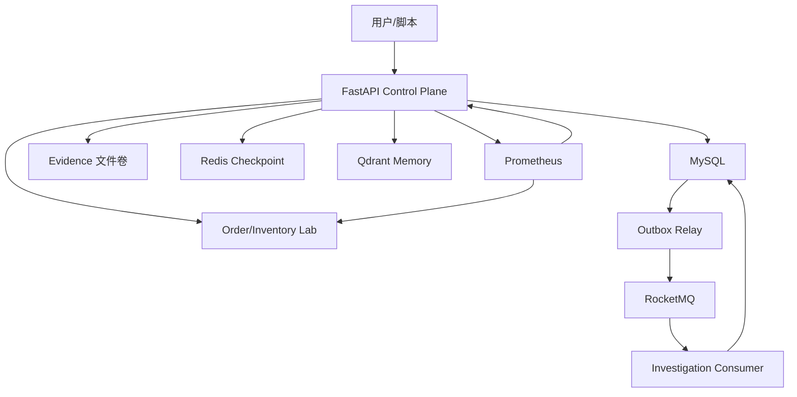

# AxiomOps 架构基线

## 目标闭环

```text
故障实验/告警
  -> Incident 控制面
  -> Typed Tools
  -> 不可变 Evidence
  -> LangGraph 多 Agent RCA
  -> Independent Verifier
  -> 已验证 RCA
  -> 人工审批
  -> Sandbox 恢复
  -> 恢复验证/回滚
  -> Prometheus 指标与评测报告
```

AxiomOps 的核心目标不是让 LLM 直接操作系统，而是让 Agent 在有证据、有边界、有审计的控制面里完成诊断，并把恢复动作交给确定性流程。

## Agent Runtime

当前 Agent 节点：

- Incident Commander
- Metrics Investigator
- Logs/Trace Investigator
- Change Investigator
- RCA Synthesizer
- Independent Verifier

确定性节点：

- Incident 创建与幂等。
- Evidence 写入与哈希校验。
- Citation Guard。
- Redis Checkpoint 和 Resume。
- 审批、权限、执行、回滚和恢复验证。
- Prometheus 指标与评测报告生成。

## 数据职责

| 组件 | 职责 |
| --- | --- |
| MySQL | Incident、事件、Outbox、Evidence 元数据、Agent Run、RCA、审批、执行审计、上下文 Capsule |
| Redis | LangGraph Checkpoint、短期可恢复状态 |
| RocketMQ | Incident 调度和业务级消息投递 |
| Qdrant | 已验证 RCA 的可重建向量索引 |
| 文件系统 | Evidence 原始 JSON、实验产物和评测报告 |
| Prometheus | Lab 服务和控制面指标采集 |

MySQL 是最终事实源。Redis、Qdrant 和文件索引均可从 MySQL 或原始产物重建，不能成为唯一事实来源。

## 核心设计原则

1. 先有 Ground Truth 故障实验，再做 Agent。
2. Agent 只能读取 Evidence 和输出结构化结果，不能直接执行恢复。
3. Evidence 和 RCA 必须可回溯、可校验、不可随意修改。
4. 恢复动作必须经过角色隔离和人工审批。
5. 简历数字只能来自保存的评测报告。

## 当前实现阶段

| Phase | 内容 |
| --- | --- |
| Phase 0 | FastAPI 项目骨架、健康检查、测试入口 |
| Phase 1 | Order/Inventory 故障实验、Prometheus、Ground Truth 产物 |
| Phase 2 | MySQL Incident 控制面、Transactional Outbox、RocketMQ |
| Phase 3 | Prometheus/Health Typed Tools、不可变 Evidence |
| Phase 4 | LangGraph 多 Agent 只读 RCA、引用安全门、Verifier |
| Phase 5 | Redis Checkpoint、Evidence Capsule、Qdrant 已验证记忆 |
| Phase 6 | Commander/Approver/Operator、Sandbox 恢复、验证与回滚 |
| Phase 7 | 控制面 `/metrics`、Trace Header、故障集与消融评测 |

## 运行时架构



## 安全恢复边界

Phase 6 已实现最小安全恢复：

- `commander` 只能申请恢复。
- `approver` 只能审批，且不能审批自己发起的申请。
- `operator` 只能执行已审批恢复。
- 当前恢复动作只允许 `reset_inventory_fault`，作用于实验环境。
- 执行记录保存 before state、action result、verification、rollback 和 error。
- 同一审批重复执行返回同一记录，避免重复副作用。

## 可观测性与评测

Phase 7 已实现：

- 控制面 `/metrics`。
- `X-AxiomOps-Trace-Id`。
- W3C `traceparent`。
- Prometheus scrape 控制面。
- `run_phase7_evaluation.py` 生成故障集和消融实验报告。

当前已验证故障集：

- `inventory_error_rate`
- `inventory_latency`
- `inventory_unavailable`

当前黑盒结果：

```text
closed_loop_pass_rate = 1.0
prometheus_evidence_coverage = 1.0
recovery_verification_rate = 1.0
```

这些数字只代表确定性实验闭环，不代表 DeepSeek 真实 RCA 质量。
