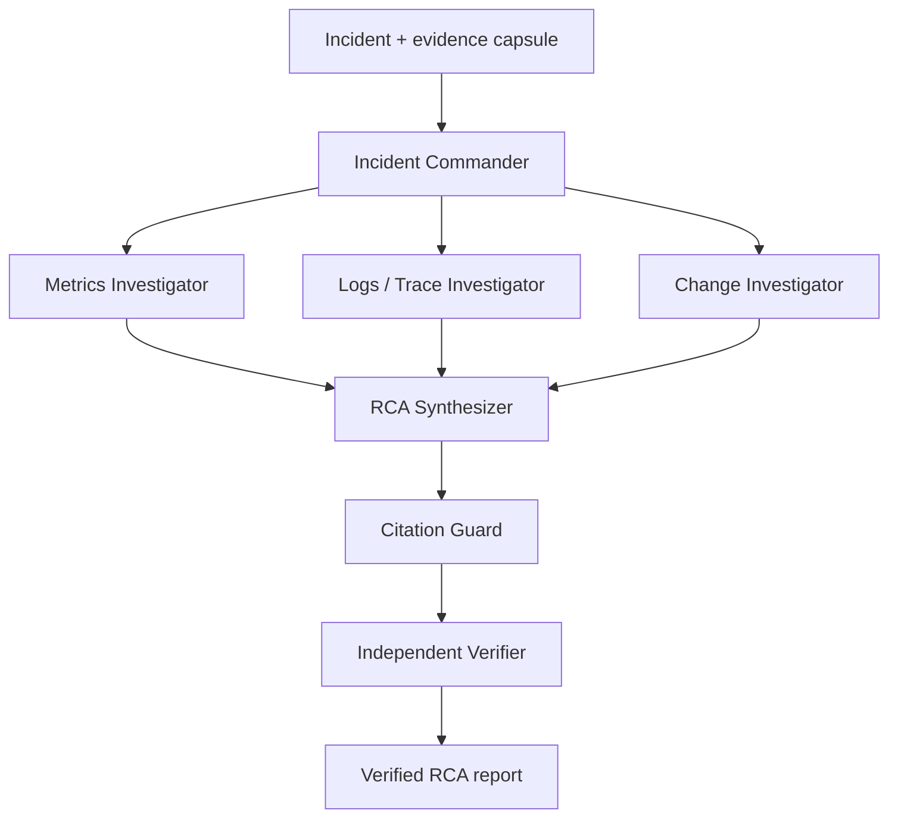
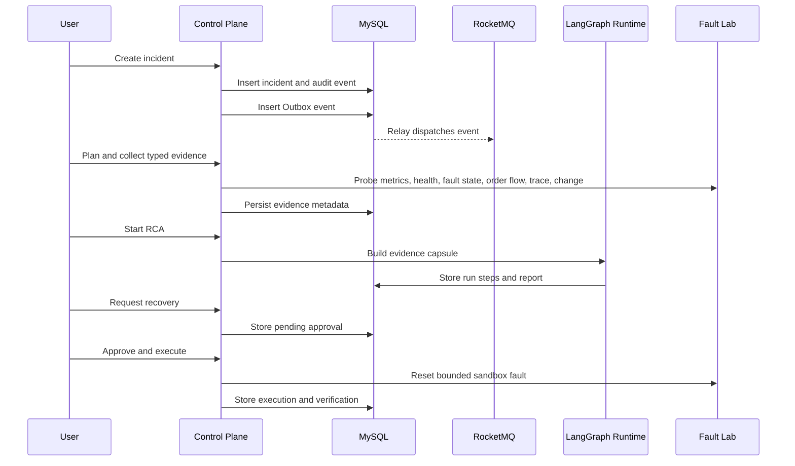

# Architecture

AxiomOps is split into a deterministic control plane, a reproducible fault lab, and a bounded multi-agent RCA runtime.

## Design Principles

- MySQL is the final source of truth for incidents, evidence metadata, RCA reports, approvals, and executions.
- Agents read evidence and produce structured RCA; they do not directly change the system.
- Recovery is executed by backend policy after role-separated approval.
- Runtime caches and indexes are rebuildable from durable records.
- Benchmarks must be generated from repeatable fault scenarios.

## Runtime Components

| Component | Responsibility |
| --- | --- |
| FastAPI control plane | Incident APIs, evidence collection, RCA orchestration, approvals, recovery |
| MySQL | Final facts, audit events, Outbox rows, RCA reports, recovery records |
| RocketMQ | Reliable business dispatch from the transactional Outbox |
| Redis | LangGraph checkpoint state and resumable runtime data |
| Qdrant | Rebuildable index of approved historical RCA records |
| Evidence file store | Raw tool responses with integrity metadata |
| Prometheus | Metrics source for lab services and control-plane observability |
| React console | Guided incident workflow and SSE timeline |

## Agent Graph

Current lab evidence covers metrics, fault state, service health, order-flow probes, lightweight trace snapshots, and change events. The trace and change sources are intentionally small local lab sources; production deployments can connect them to OpenTelemetry backends and release/configuration systems without changing the Evidence contract.

## Incident Lifecycle

## Recovery Boundary

The default recovery action is `reset_inventory_fault`, scoped to the local lab. The backend verifies:

- requester and approver are separated,
- only approved actions can run,
- each approval maps to one idempotent execution,
- service health and order-flow checks pass after recovery,
- rollback information is recorded if verification fails.
