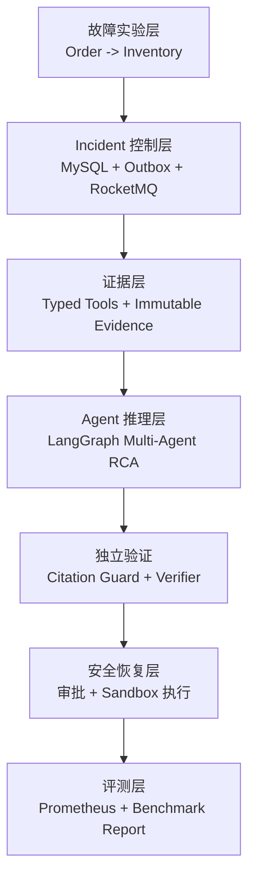

# 项目背景与方案设计

AxiomOps 是一个面向微服务故障场景的证据驱动多 Agent 智能故障诊断与安全恢复系统。项目重点不是让大模型直接接管运维，而是把 Agent 放进一个有证据、有权限、有审计、有回滚边界的控制面中，让诊断结果和恢复动作都能被工程系统验证。

## 业务背景

在微服务系统中，一个用户请求往往会穿过多个服务。以本项目的实验链路为例：

```text
Order Service -> Inventory Service
```

当 Inventory Service 出现不可用、错误率升高或响应延迟升高时，Order Service 会受到直接影响，表现为订单接口 503、调用失败、端到端延迟变高或成功率下降。

真实生产环境里的排障通常不是单点问题，而是跨多类信息源的综合判断：

- 告警系统告诉你某个指标异常。
- Prometheus 显示错误率、延迟或请求量变化。
- 健康检查显示某个服务是否存活。
- Trace 或链路探测能说明业务调用是否被阻断。
- 变更记录可能提示配置、发布或依赖变化。
- 恢复动作需要审批、执行、验证和回滚记录。

如果这些信息散落在不同系统中，排障人员需要手动切换上下文，很容易出现两个问题：一是 RCA 结论缺少明确证据，二是恢复动作缺少可审计的执行链路。

## 核心痛点

### 1. 告警到根因之间缺少证据闭环

传统告警只说明“发生了异常”，但不能直接说明“为什么发生”。如果只是把告警文本丢给大模型，模型可能给出看似合理的解释，却无法证明这个解释来自当前系统状态。

AxiomOps 的处理方式是：所有 RCA 都必须基于已保存 Evidence。每条 Evidence 都有类型、工具名、原始响应、元数据和完整性哈希。

### 2. 大模型容易把推理、经验和事实混在一起

LLM 擅长归纳和生成，但在运维场景中，未经约束的生成会带来风险。它可能把历史案例当成当前证据，也可能在证据不足时给出过度自信的结论。

AxiomOps 的处理方式是：Agent 可以使用历史记忆辅助思考，但最终 RCA 的引用只能来自当前 Incident 的 Evidence。Independent Verifier 会检查结论是否被证据支撑。

### 3. 诊断和执行混在一起会放大风险

如果让 LLM 一边判断问题一边直接执行恢复动作，系统很难保证权限、审批、幂等和回滚。一旦恢复动作错误，影响会比错误诊断更大。

AxiomOps 的处理方式是：Agent 不直接执行恢复。恢复动作由后端确定性节点控制，必须经过 Commander 申请、Approver 审批和 Operator 执行。

### 4. 没有 Ground Truth 就无法证明效果

很多智能运维 Demo 只能展示一次成功输出，却无法回答“准确率怎么来”“是否可重复”“换一种故障是否还能工作”。

AxiomOps 的处理方式是：先构建带 Ground Truth 的故障实验，再写 Agent。每个场景都有明确根因、触发方式、观测指标和恢复验证路径。

## 总体方案

AxiomOps 使用四层结构完成故障处置闭环：



### 故障实验层

项目内置 Order Service 与 Inventory Service 两个微服务，通过 Docker Compose 启动。实验场景包括：

| 场景 | 根因 |
| --- | --- |
| `inventory_unavailable` | 库存依赖不可用，返回 503 |
| `inventory_error_rate` | 库存服务错误率升高 |
| `inventory_latency` | 库存响应延迟升高 |

这些场景让系统可以反复验证，而不是只依赖一次人工演示。

### Incident 控制层

控制面使用 FastAPI 提供 Incident、Evidence、RCA、审批和恢复 API。MySQL 作为最终事实源，保存：

- Incident 状态
- 审计事件
- Outbox 消息
- Evidence 元数据
- Agent Run 和 RCA 报告
- 审批记录
- 恢复执行记录

RocketMQ 不承载自由聊天消息，只承载业务级调度事件。Transactional Outbox 保证业务状态和消息事件在同一事务中落库，避免“状态写了但消息没发”或“消息发了但状态没写”的不一致。

### 证据层

AxiomOps 将外部观测能力封装为 Typed Tools：

| Tool | Evidence 类型 | 作用 |
| --- | --- | --- |
| Prometheus Metrics | `METRIC_SNAPSHOT` | 采集错误率、延迟、请求量等指标 |
| Service Health | `SERVICE_HEALTH` | 检查服务健康状态 |
| Fault State | `FAULT_STATE` | 读取实验环境当前故障注入状态 |
| Order Flow Probe | `ORDER_FLOW_PROBE` | 探测订单链路是否被库存依赖阻断 |
| Trace Snapshot | `TRACE_SNAPSHOT` | 读取最近 Order -> Inventory 调用链路、耗时和失败点 |
| Change Event | `CHANGE_EVENT` | 读取最近故障注入、恢复或配置类变更事件 |

Evidence 原始 JSON 写入文件系统，MySQL 保存路径、哈希、类型和观测时间。读取时会做完整性校验，数据库层也拒绝更新和删除 Evidence。

为了避免 Agent 自由调用系统，AxiomOps 还提供受控工具选择：Planner 只能在白名单工具中选择当前 Incident 缺失的 Evidence 类型，真正的工具执行仍由后端完成并保存为不可变 Evidence。

### Agent 推理层

RCA 使用 LangGraph 编排多 Agent：

| 角色 | 职责 |
| --- | --- |
| Incident Commander | 读取 Incident 和 Evidence Capsule，规划调查方向 |
| Metrics Investigator | 分析 Prometheus 指标是否支持故障判断 |
| Logs / Trace Investigator | 分析链路探测、Trace 或日志类证据 |
| Change Investigator | 分析变更类线索，预留对接发布和配置变更 |
| RCA Synthesizer | 汇总调查结论，生成结构化 RCA |
| Independent Verifier | 独立检查 RCA 是否被 Evidence 支撑 |

这种设计不是为了堆 Agent 数量，而是为了让上下文隔离、角色职责和最终核验变得清晰。每个 Agent 在受限上下文中完成自己的任务，最终由 Verifier 统一判断是否批准。

### 安全恢复层

恢复动作采用确定性后端流程：

```text
Commander 请求恢复 -> Approver 审批 -> Operator 执行 -> 健康检查 -> 订单链路验证 -> 记录结果
```

当前默认恢复动作是 `reset_inventory_fault`，只作用于本地 Sandbox。系统会记录恢复前状态、执行结果、验证结果和回滚信息。同一审批只能生成一条执行记录，重复执行会返回同一结果，避免重复副作用。

## 使用的方法

AxiomOps 在实现上采用了以下工程方法：

- **先实验后 Agent**：先构建固定故障集与 Ground Truth，再接入 Agent，避免没有基准的主观评估。
- **Evidence First**：所有诊断结论都必须引用已保存 Evidence，历史记忆不能冒充当前事实。
- **Controlled Tool Selection**：Planner 在白名单工具中选择缺失证据，兼顾 Agent 调查自主性和后端安全边界。
- **Typed Tool Contract**：工具输入输出结构化，减少 Agent 自由调用带来的不确定性。
- **Citation Guard**：RCA 引用必须落在当前 Incident 的 Evidence 集合内。
- **Independent Verification**：用独立验证节点检查结论是否被证据支撑。
- **Fail Closed**：模型缺失、输出不合法或证据不足时，系统拒绝生成可执行恢复建议。
- **Deterministic Recovery**：恢复动作不由 LLM 直接执行，而由后端权限、审批和执行记录控制。
- **Observable by Default**：控制面暴露 Prometheus 指标，并返回 Trace Header 关联请求链路。

## 达到的效果

当前项目已经完成从故障注入到恢复验证的完整闭环。

| 结果 | 数据 |
| --- | --- |
| 确定性故障闭环 | 3 / 3 通过 |
| Prometheus Evidence 覆盖率 | 100% |
| 恢复验证通过率 | 100% |
| 多 Agent 根因命中 | 9 / 9 |
| 单 Agent 根因命中 | 9 / 9 |
| 多 Agent 严格 Evidence 引用覆盖 | 8 / 9 |
| 单 Agent 严格 Evidence 引用覆盖 | 0 / 9 |
| 多 Agent 平均延迟 | 20.28s |
| 单 Agent 平均延迟 | 3.06s |

这些结果体现了项目的工程价值：

- 对固定故障集，系统能稳定完成创建 Incident、采集 Evidence、生成 RCA、审批恢复和验证恢复。
- 多 Agent 没有在小规模确定性数据集上虚构准确率优势，但显著提升了 Evidence 引用质量。
- 独立验证和审批门禁让 Agent 输出从自由文本建议变成可审计、可追溯的工程产物。
- 延迟和 Token 成本更高，因此完整多 Agent 链路更适合高风险 Incident；低风险场景可以使用轻量路径。

## 项目边界

AxiomOps 当前聚焦本地可复现实验环境，不宣称已经覆盖完整生产级 AIOps 平台。项目已经提供轻量 Trace Snapshot 和 Change Event Evidence，用于证明链路与变更证据如何进入 RCA；真实日志平台、Trace 后端、发布平台和配置中心的接入仍属于后续生产化扩展方向。

项目保留这个边界，是为了让当前能力可运行、可测试、可解释，而不是把未接入的数据源包装成已完成能力。
